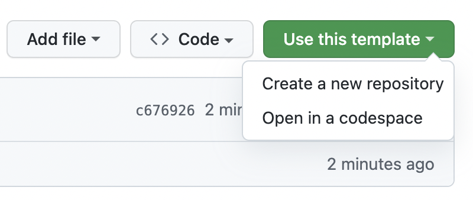

# Day-ahead electricity price forecasting — take-home case

You are forecasting **15-minute day-ahead electricity prices for Germany (DE)**.

Every feature parquet carries **`target_time`** (the delivery interval a value
describes) and **`available_at`** (when that value became known), so you can infer what
information is available at any forecast time. Forecasts are made from rolling
**origins (`ref_time`) every 6 hours** (00/06/12/18 UTC): from each origin, predict
every 15-min interval up to **72 hours ahead**, except intervals whose auction result
was already published at that origin (`src.data.forecast_index` builds exactly this
set of `(ref_time, target_time)` pairs). What is knowable differs per origin — the
same lagged feature can be published for one origin and not yet auctioned for another.

You have ~4 hours. You will not have time to do everything one could imagine here.
**Ship something that runs end to end, prioritise deliberately, and tell us what you
chose to skip and why.**

## Setup (~5 minutes)

Requires [uv](https://docs.astral.sh/uv/) and Python ≥ 3.12 (pinned in
`.python-version`; `uv sync` fetches it automatically if missing).

**Step 1: Create a new repo from this template and make it private.**

👇



**Step 2: Share your new repo with the reviewers**
(repo Settings → Collaborators → Add people):

- `paul.romieu@electricitymaps.com`
- `viktor.andersson@electricitymaps.com`
- `robin.troesch@electricitymaps.com`
- `bastien.bigue@electricitymaps.com`
  
**Step 3: Clone it locally and get the project up and running.**

The dataset is not in the repo: you download it with the **signed URL you received
by email** alongside this case (the `<signed-url-you-received>` below). It is valid
for 7 days; if it has expired or you never got one, ask us for a fresh link.

```bash
git clone <your-new-repo-url>
cd <repo-name>
uv sync
curl -L -o data.tar.gz "<signed-url-you-received>"
tar xzf data.tar.gz          # unpacks into data/
uv run pytest                # sanity check
uv run python -m src.run --model dummy_model # weekly-naive sanity model
uv run python -m src.run --model baseline    # the Ridge bar to beat, end to end
```

## The data

`data/` contains nine feature signals plus the target — see `DATA_DICTIONARY.md` for
every column. Each signal has a dual temporal index:

- `target_time`: the datetime the value describes (delivery interval)
- `available_at`: when that value became known / was published (tz-aware UTC)

One `target_time` therefore appears in **several rows**, one per `available_at`
snapshot, capturing how the known value evolved over time.

**Don't worry about data loading — it is already done for you.** Once
`tar xzf data.tar.gz` has unpacked the files into `data/`, the scaffold reads every
signal from there automatically (`src.data.CATALOG` maps signal names to files), and
features declared via `FeatureSpec` pull from them on demand — leakage-safe via
`pit_lookup`. Your time should go into *which* features and models, not plumbing.

Prices and grid measurements (load, production) are available for **multi-zone**: the column `zone_key` is expressing the zone. You will find data for DE plus its 11 electrical neighbours (CH has load but no production data); weather is DE-only. Select a neighbour via the `zone` argument of `FeatureSpec` / `pit_lookup`.

- **Train:** origins 1 Oct 2025 – 27 Apr 2026 (targets through 30 Apr).
- **Test:** origins 29 Apr – 29 May 2026 (6-hourly); **only May targets are scored**,
  with per-lead-band metrics (0–24h / 24–48h / 48–72h).
- The test-month target ships with the data so you can self-score. We recompute your
  score from your predictions and re-run your code; do not fit or tune on the test
  month. `run.py` prints the test score for convenience — for model iteration, carve
  a validation window out of the training period instead (your WRITEUP asks how).

## The scaffold

The plumbing is done so you can spend your time on features and models:

- `src/interface.py` — `FeatureSpec` / `DerivedFeature` / `CalendarFeature` / `ModelSpec`.
- `src/data.py` — signal catalog (`CATALOG`, `catalog_columns()`), loaders, and
  `pit_lookup`, the point-in-time primitive.
- `src/features.py` — `build_features()` plus one worked example per mechanism
  (price lag, weather forecast, derived feature, calendar).
- `src/models.py` — the `MODELS` registry: `dummy_model` (weekly naive) and
  `baseline` (minimal Ridge — the bar to beat).
- `src/run.py` / `src/score.py` — the generic loop and the scorer.

**You are encouraged to create your own features.** Three mechanisms, each with a
worked example in `src/features.py`:

- **Tap a new signal**: a `FeatureSpec` can pull any column of any `CATALOG` signal,
  for any zone, at any lag — most of the nine signals are wired to nothing yet.
- **Combine existing features**: a `DerivedFeature` computes a new column from other
  features (see `price_wow_change`: yesterday's price minus the week before). Ratios,
  spreads, deltas, interactions — anything expressible as a function of its inputs.
- **Calendar / structural**: a `CalendarFeature` derives from the
  `(ref_time, target_time)` index alone (hour of day, lead time, ...).

Adding a feature is one declaration; adding a model is one registry entry:

```python
MODELS["mine"] = ModelSpec(
    features=[price_lag_168h, ssrd_top_1, my_new_feature, ...],
    regressor=LGBMRegressor(),   # anything with fit/predict
)
```

Declare features you reuse in `src/features.py` (one-off specs can sit inline in the
feature list); register models in `src/models.py`, or grow into new modules under
`src/` / `solution/` — just make sure `uv run python -m src.run --model <yours>`
reproduces your submission.

## Deliverables

Push everything to your repo (shared in Step 2) — the whole repo is the hand-in, not
just the parquet. Hand-in checklist:

- [ ] **`<model>_predictions.parquet`** from your **final** model (`run.py` names the
      file after the registry entry). Columns: `ref_time`, `target_time` (exactly the
      pairs from `src.data.test_index()` — 23,048 with the shipped windows),
      `price_forecast` (no NaNs), and `model`.
- [ ] **It validates**: `uv run python -m src.score <model>_predictions.parquet`
      exits clean and prints your scores.
- [ ] **`WRITEUP.md`** with every section filled in. Section 4 (what you deprioritised
      and why) matters as much as your score. If you ran several models, say which
      file is your submission.
- [ ] **Your code**, with your final model registered in `MODELS`, such that a fresh
      clone + data download + `uv run python -m src.run --model <yours>` regenerates
      your parquet. We will re-run it — predictions we can't reproduce don't count.
- [ ] **`uv run pytest` still passes.**

## Ground rules

- **AI tools are allowed** — you would use them on the job. Mention notable usage in
  the writeup. A follow-up debrief will go through your choices in depth.
- Beat the `baseline` model (Ridge) on the test month; beyond that, we grade reasoning,
  correctness, and prioritisation over raw score.
